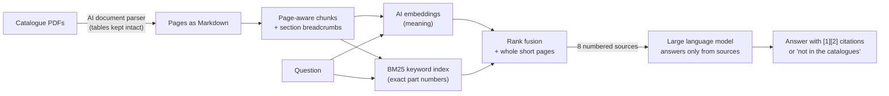
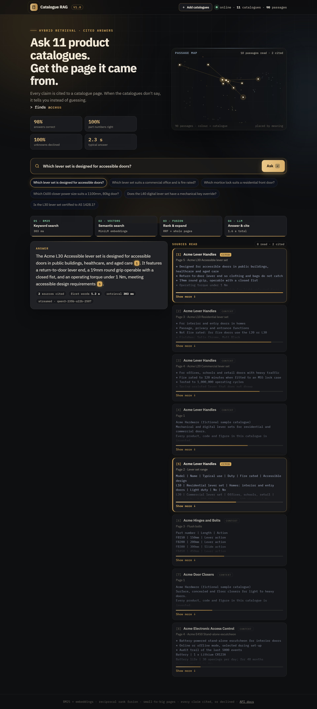
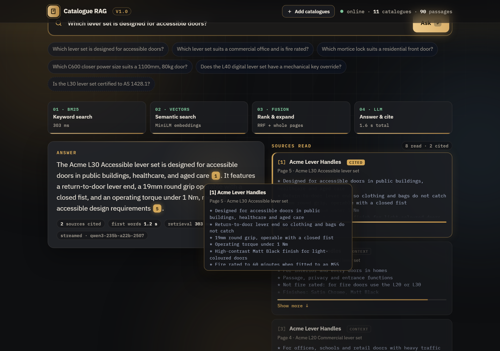
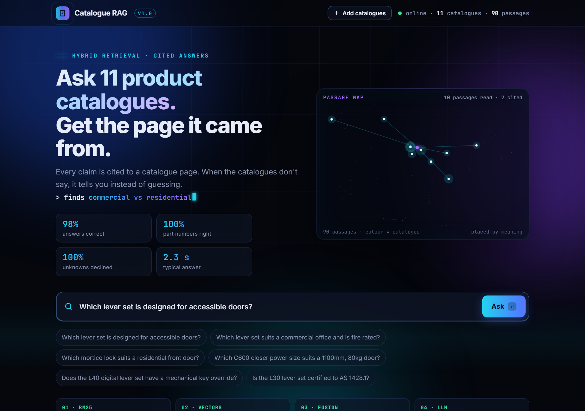
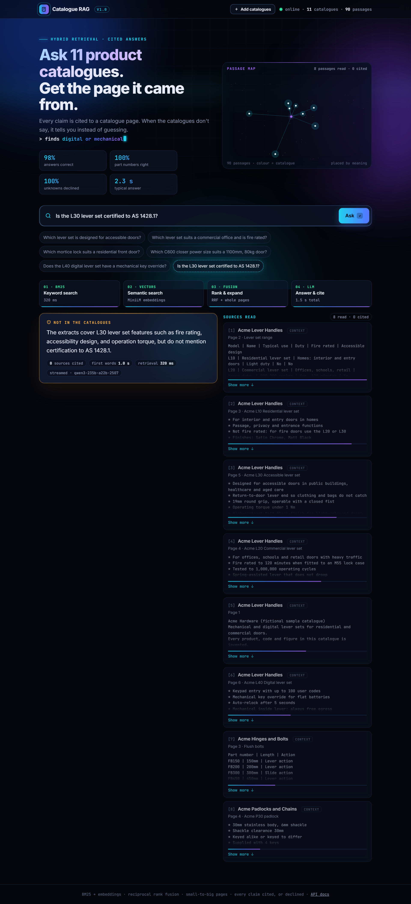
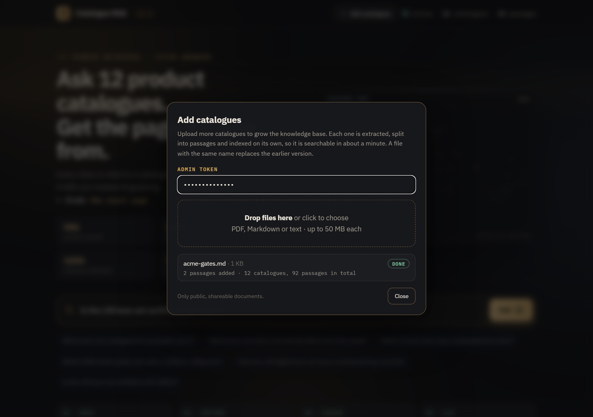
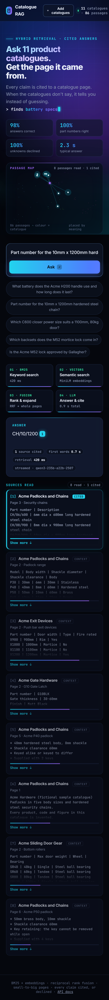

# Catalogue RAG

[](https://github.com/samiulhuda360/catalogue-rag/actions/workflows/ci.yml)


**An AI product expert for door hardware: ask your catalogues a question and get an answer with the exact page
it came from, or an honest "not in the catalogues".**

Built for the people who answer hardware questions all day (sales, trade counters, installers, specifiers):
which battery, which part number, which closer size, does it fit a 44 mm door. Measured on 54 public door
hardware catalogues (3,062 passages): **98% correct answers, 100% of unanswerable questions declined, about
2 seconds per answer.** It can also run on a company's own GPU servers as a private knowledge base.


All catalogue knowledge comes from public sources ([details](#data)). The demo and screenshots use ten
fictional "Acme" catalogues that ship with the repository.

## Results

46 questions written from the catalogues, every expected answer checked against the source text; 6 of them
deliberately unanswerable (vendor approvals, prices, building-code clauses). Same language model for both
versions, so the gains come from the retrieval and prompting design. Full report:
[`eval/results/REPORT.md`](eval/results/REPORT.md).

| | First version | This version |
|---|---|---|
| Correct answers | 20% | **98%** |
| Part-number questions correct | 7% | **100%** |
| Answer text reaches the model | 30% | **98%** |
| Declines questions the catalogues don't answer | 83% | **100%** |
| Wrongly declines answerable questions | 55% | **2%** |
| Cites the catalogue the answer came from | (no citations) | **98%** |
| Median answer time | 6.2 s | **2.3 s** |

The first version usually found the right catalogue but sent the model only its first 2,000 characters.
[How that was fixed](docs/architecture.md).

## How AI powers it



| Step | What does the work | Why |
|---|---|---|
| Read the PDFs | **AI document parser** (LlamaParse) turns each page, including its specification tables, into Markdown | Catalogues are mostly tables; plain PDF text extraction scrambles them |
| Understand meaning | **Embedding model** (all-MiniLM-L6-v2, runs locally) turns every passage and question into a vector | Finds "how long does the battery last" in a row labelled `Battery life` |
| Match exact codes | **BM25 keyword search** with a tokenizer that understands part numbers (`C700HOSIL` = model C700, hold-open, silver) | Embedding models blur codes; a part number must match exactly |
| Combine | **Reciprocal rank fusion**, weighted towards keywords (weight chosen by [measurement](eval/results/weight_sweep.md)) | Each search catches what the other misses |
| Write the answer | **Large language model** (Qwen3 235B by default; any OpenAI-compatible model, including self-hosted) | Reads the 8 best passages and answers in plain language, citing `[n]` after every claim |
| Stay honest | Strict instructions plus code checks: no source, no claim; otherwise decline | Wrong part numbers cost money; "I don't know" is a valid answer |
| Prove it | **Evaluation harness** that runs every question through each retriever and the full system | Every change is measured against the previous version, not judged by feel |

Deliberately *not* left to AI: exact code matching, mapping citations back to pages, and deciding when an
answer was declined. Those are deterministic code, so they can be tested.

More on the design and its trade-offs: [`docs/architecture.md`](docs/architecture.md).

## Screenshots

| Every claim cites its page | Hover a citation to read the source |
|---|---|
|  |  |

| Retrieved passages light up on the map of all passages | Declines what the catalogues don't say |
|---|---|
|  |  |

| Add catalogues without rebuilding | Works on a phone |
|---|---|
|  |  |

## For companies: your own AI knowledge base

The same system works for any company whose knowledge lives in documents: catalogues, installation guides,
service bulletins, compliance documents, resolved support tickets.

- **One knowledge base, two audiences.** Customers and partners get answers from public material on the
  website; staff also get internal documents such as price lists, installation notes and service history.
  Access is checked *before* search, so the AI never sees a document the user may not read.
- **Runs on your own GPU servers.** Point it at a self-hosted model server (vLLM, Ollama, TGI) with one
  setting, `LLM_BASE_URL`, and questions never leave the building.
- **Grows with the company.** New documents are added from the browser in about a minute, with no rebuild.
  Every question the system declines points at a gap in the documentation.

**Does it replace experts?** It scales them. Routine questions with a documented answer (specs, part
numbers, compatibility, documented fixes) get an instant, cited answer at any hour, so experts stop answering
the same questions all day. Anything undocumented, unsafe or a judgement call is declined and goes to a person,
and that person's answer becomes a new document. Over time the company depends less on whoever happens to know.

Current limits, how to overcome them with your own GPU hardware, sizing guidance and a phased adoption plan:
**[`docs/enterprise.md`](docs/enterprise.md)**.

## Run it

Python 3.11+.

```bash
git clone https://github.com/samiulhuda360/catalogue-rag && cd catalogue-rag
python -m venv venv && source venv/bin/activate          # Windows: venv\Scripts\activate
pip install -e ".[dev,parse]"
cp .env.example .env      # add OPENROUTER_API_KEY, or LLM_BASE_URL for your own model server
```

**Try it on the bundled sample** (ten fictional catalogues; used automatically when `data/` is empty):

```bash
python -m catalogue_rag index
python -m catalogue_rag ask "Which C600 closer power size suits an 1100mm, 80kg door?"
python -m catalogue_rag serve                              # web UI on http://127.0.0.1:8000
```

**Use your own catalogues:** put PDFs in `data/documents/`, add `LLAMA_CLOUD_API_KEY` to `.env`, then

```bash
python -m catalogue_rag parse      # PDF -> Markdown (only new files)
python -m catalogue_rag index      # chunk + embed
python -m catalogue_rag search "H200 right hand satin chrome"   # what retrieval finds, no LLM call
```

**Evaluate:** `python eval/run_eval.py` (or `--retrieval-only`, free and fast). It uses the sample's questions
(`examples/questions.jsonl`) until you write your own in `eval/questions.jsonl`. On the sample: 21 of 21 correct.

**Test:** `pytest` (37 tests, no API key or documents needed; runs in CI on every push). Guide from unit tests
to a by-hand checklist: [`docs/testing.md`](docs/testing.md).

## Growing the knowledge base

New catalogues can be added at any time without rebuilding the index: each one is extracted, chunked and
embedded on its own, and is searchable in seconds (Markdown) to about a minute (PDF). A file with the same name
replaces its earlier version.

- **Web UI:** set `CATALOGUE_ADMIN_TOKEN` in `.env` and an **Add catalogues** button appears: enter the token,
  drop PDFs or Markdown files, and watch each one go through extracting, indexing, done.
- **Command line:** `python -m catalogue_rag add new-catalogue.pdf more.md`
- **API:** `POST /api/documents/upload?filename=x.pdf` with the file as the body and an `X-Admin-Token` header;
  `GET /api/jobs` for progress.

Uploads are **off unless a token is set**, so a public demo cannot be fed documents. The token is compared in
constant time, file names are sanitised, only PDF, Markdown and text are accepted (PDFs are checked by
signature), size is capped (`CATALOGUE_MAX_UPLOAD_MB`, default 50), and jobs run one at a time.

## API

| Endpoint | |
|---|---|
| `POST /api/ask` | `{"question": "...", "top_k": 8}` returns the answer, whether it declined, citations (document, title, page, section, snippet) and timings |
| `POST /api/ask/stream` | The same as server-sent events: sources as soon as retrieval finishes, then the answer as it is written |
| `GET /api/map` | 2-D projection (PCA) of every passage's embedding, drawn by the UI as the passage map |
| `POST /api/documents/upload`, `GET /api/jobs` | Add catalogues (token-gated, see above) |
| `GET /api/health`, `GET /api/documents`, `GET /api/admin` | Status, catalogue list, whether uploads are on |

Interactive docs at `/docs` when the server is running.

## Project layout

```
src/catalogue_rag/   chunking  bm25  index  retrieval  generation  pipeline  api  ingest  uploads  projection  __main__
ui/index.html        single-file web UI (no build step)
eval/                run_eval.py  sweep_weights.py  results/  baseline/ (the first version, kept for comparison)
tests/               chunking, BM25, fusion, citations, streaming, API, uploads, config
docs/                architecture.md  enterprise.md  testing.md  sources.md  screenshots/
examples/            make_sample.py, parsed/ (ten fictional catalogues), questions.jsonl
```

## Stack

Python · FastAPI · ChromaDB · all-MiniLM-L6-v2 embeddings (local, CPU) · BM25 (own implementation) ·
LlamaParse · any OpenAI-compatible LLM (Qwen3 235B via OpenRouter by default, or self-hosted with vLLM/Ollama) ·
vanilla JS + Canvas UI · pytest · ruff · GitHub Actions.

## Data

All catalogue knowledge used by this project comes from publicly available sources: product catalogues and
brochures that manufacturers publish for free download on their own websites. No internal, confidential or paid
material was used. The 54 evaluation catalogues belong to their publishers and are not in this repository, nor
is any text extracted from them. The screenshots, demo and bundled sample use invented "Acme" products. This is
an independent portfolio project, not affiliated with or endorsed by any manufacturer.
Details: [`docs/sources.md`](docs/sources.md).

## Author

Samiul Huda · Auckland, New Zealand · MSc Data Science. MIT licence.
