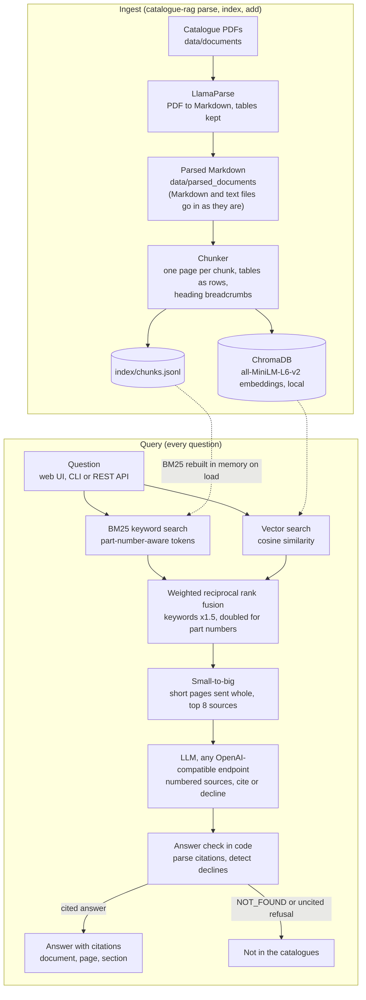
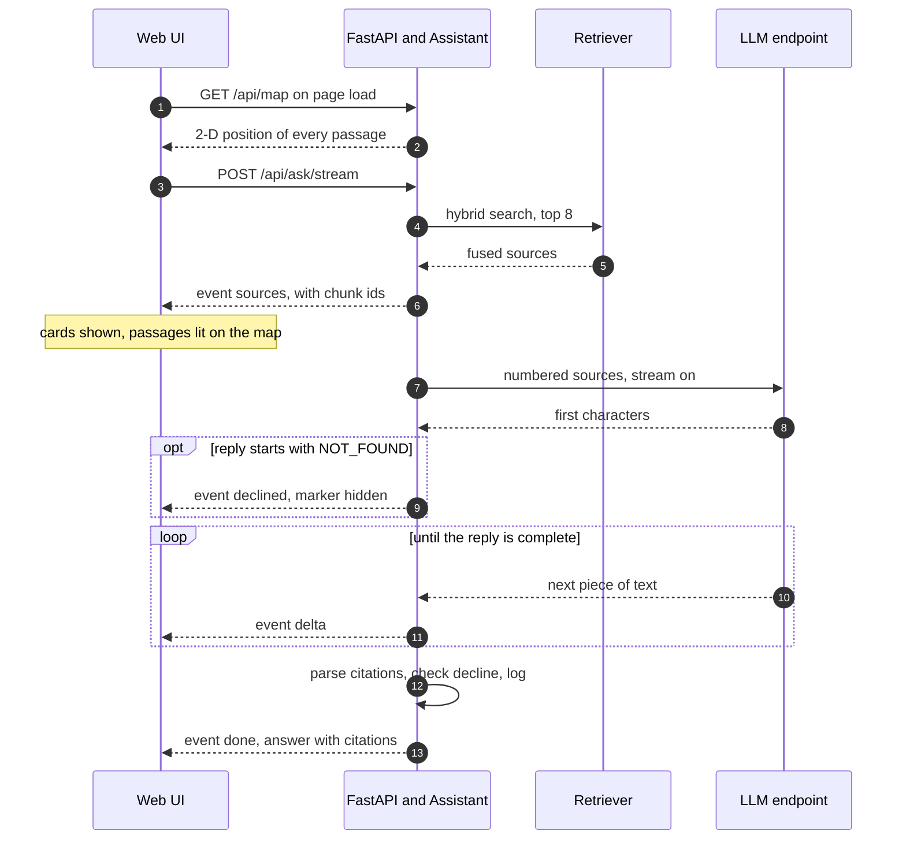
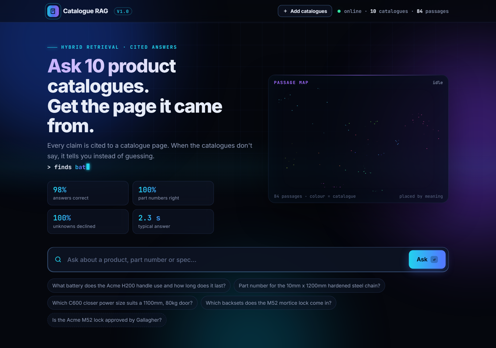

# Catalogue RAG

[](https://github.com/samiulhuda360/catalogue-rag/actions/workflows/ci.yml)


**A retrieval-augmented (RAG) assistant for door hardware product catalogues: ask a question in plain language
and get a grounded answer that cites the catalogue page it came from, or a clear "not in the catalogues".**

It is built for the people who answer door hardware questions all day (sales, trade counters, installers,
specifiers, customer service) and for any team whose product knowledge lives in PDF catalogues. Hybrid search
(BM25 keywords plus local embeddings) finds the passages, a language model answers only from those passages, and
every claim links to its page. On 54 public door hardware catalogues and 46 test questions it answers 98% of the
answerable questions correctly, declines all of the questions the catalogues cannot answer, and takes a median of
2.3 seconds per answer ([evaluation](#evaluation)).


All catalogue knowledge comes from public sources ([data sources](#data-sources)). The demo and screenshots use
eleven fictional "Acme" catalogues that ship with the repository.

## Key features

- **Hybrid retrieval.** BM25 keyword search with a part-number-aware tokenizer, plus all-MiniLM-L6-v2 embeddings
  in ChromaDB (run locally on CPU), merged with weighted reciprocal rank fusion.
- **Page-aware, table-preserving chunks.** A chunk never spans two pages, tables stay readable as rows, and every
  chunk carries its section breadcrumb, so every answer can cite a page.
- **Small-to-big context.** Short pages go to the model whole, so related facts on one specification sheet arrive
  together.
- **Cite or decline.** Every claim carries a `[n]` citation mapped back to document, page and section. When the
  sources don't answer the question, the reply is a clear "Not in the catalogues", checked by code as well as by
  the prompt.
- **Streaming web UI.** Sources appear as soon as retrieval finishes, the answer streams in, citation chips preview
  their source, and a passage map of the whole knowledge base lights up the passages that were read.
- **Add catalogues at runtime.** Token-gated uploads from the browser, CLI or API. Only the new document is
  extracted, chunked and embedded; a file with the same name replaces its earlier version.
- **Any OpenAI-compatible model.** OpenRouter (Qwen3 235B) by default, or a self-hosted vLLM, TGI, Ollama or
  LM Studio server through one setting.
- **Measured.** An evaluation harness compares retrieval configurations and the full pipeline on the same
  questions; 38 unit and API tests run in CI without an API key.

### Questions it handles

Examples from the bundled sample catalogues:

| Kind of question | Examples |
|---|---|
| **Commercial or residential** | Which mortice lock suits a commercial entrance door, and which a residential front door? Which lever set is heavy duty for a school? |
| **Mechanical or digital** | Does the L40 digital lever set have a mechanical key override? Which keypad works offline? |
| **Fire-rated doors** | Which lever sets are fire rated, and for how many minutes? Which exit devices are fire rated? |
| **Accessibility** | Which lever set is designed for accessible doors, and what makes it accessible? |
| **Sizing and selection** | Which C600 closer power size suits an 1100mm, 80kg door? Which backsets does the M52 come in? Which friction stay suits a 750mm sash? |
| **Part numbers and finishes** | Part number for the H200 handle in Satin Chrome, right hand? The 10mm x 1200mm chain? The 35/45 euro cylinder? |
| **Declined unless a catalogue states it** | Prices, warranties, third-party approvals, building-code or standards compliance ("Is the L30 lever set certified to AS 1428.1?") |

It reports what the documents say; it does not certify compliance. Fire and accessibility answers cite the
catalogue page so a specifier can check the rating, conditions and fitting requirements.

## Architecture



- **Entry points.** The web UI (`ui/index.html`, served at `/`), the REST API (FastAPI) and the CLI share one
  pipeline, `pipeline.Assistant`.
- **Stores.** `index/chunks.jsonl` is the source of truth for passages and BM25 is rebuilt from it when the index
  loads; ChromaDB holds the embeddings; `index/manifest.json` records what was indexed; `index/map.json` caches
  the passage map; `logs/questions.jsonl` records each question, whether it was declined, the cited pages and the
  timings.
- **External services.** The language model endpoint, and LlamaParse for PDF extraction. Embeddings and keyword
  search run locally.

Module-level detail and the reasoning behind each choice: [`docs/architecture.md`](docs/architecture.md).

## How it works


1. **Parse.** `parse` sends each new PDF in `data/documents/` to LlamaParse, which returns Markdown with the
   specification tables as HTML and a `---` line between pages. Files already parsed are skipped. Markdown and
   text catalogues skip this step.
2. **Chunk.** Each page is split into chunks of at most 1,200 characters that never cross a page. Tables become
   `cell | cell` rows, and a table too big for one chunk is split by rows with its header row repeated. Each
   chunk carries a breadcrumb such as `Acme Electronic Access Control > Acme H200 Wireless access handle >
   Technical data`, so a row like `Battery | 3 x LR03 AAA 1.5V` still says which product it describes.
3. **Index.** Chunks are written to `index/chunks.jsonl` and embedded into ChromaDB with all-MiniLM-L6-v2, which
   runs locally. The BM25 index is rebuilt in memory from the chunk file whenever the index loads.
4. **Retrieve.** Each question runs through BM25 and vector search (40 candidates each). Weighted reciprocal rank
   fusion merges the two rankings without calibrating their scores: keywords count 1.5 times, and twice that
   when the question contains a part number.
5. **Expand.** When a matched chunk's page is short (several chunks, at most 3,500 characters in total), the whole
   page becomes one source and each page appears only once. The top 8 sources go to the model.
6. **Answer.** The language model (temperature 0) sees the sources numbered `[1]`, `[2]` and so on. It must cite
   after every claim, copy part numbers and units exactly, and start its reply with `NOT_FOUND` when nothing in
   the sources answers the question.
7. **Check.** Code maps the citations back to document, page and section, and marks the reply as declined when it
   starts with `NOT_FOUND` or cites nothing while saying the extracts don't cover the question. A cited answer
   that notes a gap stays an answer.
8. **Log.** Each question is appended to `logs/questions.jsonl`.

### Streaming an answer

The web UI uses `POST /api/ask/stream`, which sends server-sent events (SSE) so the sources show up before the
answer is written:



### Who does what

| Step | What does the work | Why |
|---|---|---|
| Read the PDFs | **AI document parser** (LlamaParse) turns each page, including its specification tables, into Markdown | Catalogues are mostly tables; plain PDF text extraction scrambles them |
| Understand meaning | **Embedding model** (all-MiniLM-L6-v2, local) turns every passage and question into a vector | Matches paraphrases that share few words, such as "how long does the battery last" and a row headed "Battery life" |
| Match exact codes | **BM25 keyword search** with a tokenizer that understands part numbers (`C700HOSIL` = model C700, hold-open, silver) | Embedding models blur codes; a part number must match exactly |
| Combine | **Weighted reciprocal rank fusion**, keyword weight chosen by a [measured sweep](eval/results/weight_sweep.md) | Merges exact-code matches and meaning matches by rank, without calibrating two different score scales |
| Write the answer | **Large language model** (Qwen3 235B by default; any OpenAI-compatible model, including self-hosted) | Reads the 8 best sources and answers in plain language, citing `[n]` after every claim |
| Grounded or declined | Prompt rules plus code checks: no source, no claim | A wrong part number costs money; "not in the catalogues" is a valid answer |
| Measure | **Evaluation harness** that runs the same questions through each retriever and the full pipeline | Every configuration is compared on the same questions |

Deliberately *not* left to AI: exact code matching, mapping citations back to pages, and deciding when an answer
was declined. Those are deterministic code, so they can be tested.

## Screenshots

| Home: ask a question or pick an example | Hover a citation to preview its source |
|---|---|
|  |  |

| Every claim cites its catalogue page | Declines what the catalogues don't state |
|---|---|
|  |  |

| Passages that were read light up on the map | Add catalogues without a rebuild |
|---|---|
|  |  |

| Phone layout (full page) |
|---|
|  |

## Tech stack

| Layer | Technology |
|---|---|
| Language | Python 3.11+ |
| API | FastAPI, Uvicorn, Pydantic, with OpenAPI docs at `/docs` |
| Vector store | ChromaDB, embedded and persistent, cosine distance |
| Embeddings | all-MiniLM-L6-v2 (ChromaDB's default embedding function), run locally on CPU |
| Keyword search | Okapi BM25, own implementation with a part-number-aware tokenizer |
| Language model | Any OpenAI-compatible endpoint through the OpenAI Python SDK: OpenRouter with `qwen/qwen3-235b-a22b-2507` by default, or self-hosted vLLM, TGI, Ollama or LM Studio |
| PDF extraction | LlamaParse through the `llama-cloud` SDK (optional `parse` extra) |
| Web UI | One HTML file, vanilla JavaScript and Canvas, no build step |
| Passage map | PCA of the embeddings with NumPy |
| Quality | pytest, httpx, ruff, GitHub Actions |

## Getting started

### Prerequisites

- Python 3.11 or newer.
- To generate answers: an API key for an OpenAI-compatible model endpoint (OpenRouter by default), or the URL of
  your own model server. Building the index and `search` need no key.
- To add PDF catalogues: a LlamaCloud API key for LlamaParse. Markdown and text catalogues need no key.

### Install

```bash
git clone https://github.com/samiulhuda360/catalogue-rag && cd catalogue-rag
python -m venv venv && source venv/bin/activate          # Windows: venv\Scripts\activate
pip install -e ".[dev,parse]"
cp .env.example .env                                      # Windows: copy .env.example .env
```

### Configure

Settings are read from environment variables or from `.env` in the project root. Only the model settings are
needed to start.

| Variable | Purpose |
|---|---|
| `OPENROUTER_API_KEY` | Key for OpenRouter, the default model provider |
| `OPENROUTER_MODEL` | Model on OpenRouter (default `qwen/qwen3-235b-a22b-2507`) |
| `LLM_BASE_URL` | Any OpenAI-compatible endpoint, such as a self-hosted vLLM, TGI, Ollama or LM Studio server; overrides the OpenRouter settings |
| `LLM_MODEL` | Model name on that endpoint |
| `LLM_API_KEY` | Key for that endpoint, only if it requires one |
| `LLAMA_CLOUD_API_KEY` | LlamaParse key, only needed to extract PDFs |
| `CATALOGUE_ADMIN_TOKEN` | Switches on adding catalogues from the web UI and API; uploads stay off while it is empty |
| `CATALOGUE_MAX_UPLOAD_MB` | Upload size limit (default 50) |
| `CATALOGUE_DOCUMENTS_DIR` | Folder of source PDFs (default `data/documents`) |
| `CATALOGUE_PARSED_DIR` | Folder of parsed Markdown (default `data/parsed_documents`, or the bundled sample while that is empty) |
| `CATALOGUE_INDEX_DIR` | Index folder (default `index`) |
| `CATALOGUE_BM25_WEIGHT` | Keyword weight in the rank fusion (default 1.5) |
| `CATALOGUE_BRANDS` | Optional comma-separated names to recognise in file names, stored as metadata |

### Run on the bundled sample

The eleven fictional sample catalogues are used automatically while `data/parsed_documents/` is empty.

```bash
python -m catalogue_rag index                                    # chunk and embed (90 passages)
python -m catalogue_rag search "CH/10/1200"                      # retrieval only, no key needed
python -m catalogue_rag ask "Which lever set is designed for accessible doors?"
python -m catalogue_rag serve                                    # web UI and API on http://127.0.0.1:8000
```

On Windows, `start.bat` builds the index if it is missing, opens the browser and starts the server (it expects
the virtual environment in `venv\`).

### Use your own catalogues

```bash
# put PDFs in data/documents/ and set LLAMA_CLOUD_API_KEY in .env
python -m catalogue_rag parse          # PDF to Markdown, new files only (--force to parse again)
python -m catalogue_rag index          # chunk and embed everything
```

To add catalogues to an existing index without a rebuild, see [Adding catalogues](#adding-catalogues).

## Usage

### Web UI

Run `python -m catalogue_rag serve` and open http://127.0.0.1:8000.

1. Type a question or click an example. Press `/` to jump to the question box.
2. Four stages show the request moving through keyword search, semantic search, fusion and the language model.
3. The sources appear as soon as retrieval finishes, and the passages that were read light up on the passage map.
   Hover a dot to see its catalogue.
4. The answer streams in with `[n]` chips. Hover a chip to preview its source, or click it to jump to the source
   card. Cited sources are marked; the rest are shown as context.
5. A question the catalogues don't answer gets an amber "Not in the catalogues" card.
6. With `CATALOGUE_ADMIN_TOKEN` set, an **Add catalogues** button appears (see below).

### Command line

Run as `python -m catalogue_rag <command>`, or `catalogue-rag <command>` once the package is installed.

| Command | What it does |
|---|---|
| `parse [--force]` | Extracts the PDFs in `data/documents/` to Markdown with LlamaParse, skipping files already parsed |
| `index` | Chunks all parsed Markdown and builds the index from scratch |
| `add FILE...` | Copies PDF, Markdown or text files into `data/documents/`, then extracts and indexes only those |
| `ask "question" [--mode M]` | Answers one question with citations and timings; with no question it starts an interactive session |
| `search "query" [--mode M] [-k N]` | Shows what retrieval finds (title, page, section and the rank in each retriever) without calling the model |
| `serve [--host H] [--port P]` | Runs the web UI and API (default `127.0.0.1:8000`) |

`--mode` is `hybrid` (default), `bm25` or `vector`, which makes it easy to see which retriever carries a question:

```bash
python -m catalogue_rag search "H200SCRH" --mode bm25
python -m catalogue_rag search "H200SCRH" --mode vector
```

### REST API

| Endpoint | Purpose |
|---|---|
| `POST /api/ask` | Body `{"question": "...", "top_k": 8}` (question 3 to 500 characters, `top_k` 1 to 12). Returns the answer, whether it declined, the cited sources, every source shown to the model (document, title, page, section, snippet), timings and the model name |
| `POST /api/ask/stream` | The same as server-sent events (see below) |
| `GET /api/map` | 2-D projection of every passage's embedding, drawn by the UI as the passage map |
| `GET /api/health` | Index status and what was indexed |
| `GET /api/documents` | The catalogues in the index |
| `GET /api/admin` | Whether uploads are on, whether PDF extraction is available, and the size limit |
| `POST /api/documents/upload?filename=x.pdf` | Adds a catalogue: raw file as the body, `X-Admin-Token` header; returns a job |
| `GET /api/jobs` | Upload jobs and their state (`X-Admin-Token` header) |
| `GET /docs` | Interactive OpenAPI documentation |

```bash
curl -s http://127.0.0.1:8000/api/ask -H "Content-Type: application/json" \
  -d '{"question": "Part number for the 10mm x 1200mm hardened steel chain?"}'

curl -N http://127.0.0.1:8000/api/ask/stream -H "Content-Type: application/json" \
  -d '{"question": "Which bottom roller carries a 120kg sliding door?"}'
```

Each stream event is one `data:` line holding a JSON object with a `type`:

| Event | Sent | Contents |
|---|---|---|
| `sources` | As soon as retrieval finishes | The numbered sources, the ids of every passage shown to the model, retrieval time |
| `declined` | Only when the model is declining | Nothing else; the UI switches to the "Not in the catalogues" card |
| `delta` | While the model writes | The next piece of answer text |
| `done` | At the end | The final answer, `declined`, citations, sources, timings (retrieval, generation, first words) and the model |
| `error` | If something fails mid-stream | A short message |

### Adding catalogues

New catalogues can be added at any time without rebuilding the index. Each file is extracted (PDFs only),
chunked and embedded on its own, and a file with the same name replaces its earlier version.

- **Web UI:** set `CATALOGUE_ADMIN_TOKEN` in `.env`, click **Add catalogues**, enter the token and drop PDF,
  Markdown or text files. Each job shows its state: queued, extracting, indexing, done or failed.
- **Command line:** `python -m catalogue_rag add new-catalogue.pdf more.md`
- **API:**

  ```bash
  curl -X POST "http://127.0.0.1:8000/api/documents/upload?filename=new-catalogue.pdf" \
    -H "X-Admin-Token: $CATALOGUE_ADMIN_TOKEN" -H "Content-Type: application/octet-stream" \
    --data-binary @new-catalogue.pdf
  curl -s http://127.0.0.1:8000/api/jobs -H "X-Admin-Token: $CATALOGUE_ADMIN_TOKEN"
  ```

Uploads are off unless a token is set, so a public demo cannot be fed documents. The token is compared in
constant time, file names are sanitised, only PDF, Markdown and text files are accepted (PDFs are checked by
their signature), size is capped by `CATALOGUE_MAX_UPLOAD_MB`, and jobs run one at a time on a single worker.

## Project structure

```
catalogue-rag/
├── src/catalogue_rag/
│   ├── __main__.py        CLI: parse, index, add, ask, search, serve
│   ├── config.py          settings from environment variables and .env
│   ├── ingest.py          PDF to Markdown with LlamaParse
│   ├── chunking.py        page-aware, table-preserving chunks with breadcrumbs
│   ├── bm25.py            Okapi BM25 with a part-number-aware tokenizer
│   ├── index.py           build, update and load the index (chunks.jsonl, ChromaDB)
│   ├── retrieval.py       hybrid search, weighted rank fusion, small-to-big pages
│   ├── generation.py      prompt, streaming, citation parsing, decline detection
│   ├── pipeline.py        question in, cited answer out, plus the event stream
│   ├── api.py             FastAPI endpoints and the web UI route
│   ├── uploads.py         token-gated upload queue, one job at a time
│   └── projection.py      2-D PCA map of the passage embeddings
├── ui/index.html          single-file web UI, no build step
├── tests/                 38 unit and API tests, no API key or documents needed
├── eval/
│   ├── run_eval.py        retrieval and answer evaluation, writes REPORT.md
│   ├── sweep_weights.py   keyword-weight and source-count sweep
│   ├── baseline/          whole-document retrieval baseline used for comparison
│   └── results/           committed evaluation reports
├── examples/
│   ├── make_sample.py     generates the fictional sample catalogues and questions
│   ├── parsed/            eleven fictional "Acme" catalogues as parsed Markdown
│   └── questions.jsonl    25 evaluation questions for the sample
├── docs/                  architecture, testing guide, company adoption, data sources, screenshots
├── .github/workflows/     CI: ruff and pytest
├── .env.example           configuration template
├── start.bat              Windows launcher
└── pyproject.toml         package, extras (dev, parse), ruff and pytest settings
```

Created at run time and not committed: `data/documents/`, `data/parsed_documents/`, `index/` and `logs/`.

## Testing

```bash
pytest -q                     # 38 tests, no API key or documents needed
ruff check src tests eval
```

The tests cover the chunker (pages, tables as rows, breadcrumbs, splitting big tables), BM25 (part-number tokens
and ranking), rank fusion and small-to-big pages, citation parsing, the decline path (including a refusal without
the marker), streaming without showing the decline marker, the API with a fake model (validation, health,
server-sent events), the upload gate (off without a token, wrong token refused, file names sanitised, fake PDFs
and oversize files rejected, re-uploads replace rather than duplicate) and self-hosted model settings.

GitHub Actions runs `ruff check src tests eval` and `pytest -q` on Python 3.12 for every push and pull request.

[`docs/testing.md`](docs/testing.md) goes further: retrieval checks without a model, a by-hand checklist for the
web UI with expected answers from the sample, and the full evaluation.

## Evaluation

**Corpus and questions.** 54 public door hardware catalogues and 46 questions written from them: 40 answerable
(part numbers, specifications, table look-ups) and 6 deliberately unanswerable (vendor approvals, prices,
building-code clauses). Every expected answer was checked against the parsed source text. The catalogues are not
redistributed, so neither are the questions; the method and results are. Full report:
[`eval/results/REPORT.md`](eval/results/REPORT.md).

**How it is measured.** `eval/run_eval.py` runs every question through each configuration with the same language
model (`qwen/qwen3-235b-a22b-2507`) and 8 sources, so differences come from retrieval and prompting, not the model.
An answer is correct when every expected fact (with spelling variants) appears in it. Retrieval is scored on
whether an expected document is among the sources, whether the expected fact text is inside what the model is
shown, and the reciprocal rank of the first source that contains it.

**Full pipeline compared with a whole-document baseline.** The baseline stores each catalogue as a single vector
entry, gives the model the first 2,000 characters of each of the top 5 catalogues, and uses a generic prompt
(`eval/baseline/`).

| | Whole-document baseline | Full pipeline |
|---|---|---|
| Correct answers | 20% | **98%** |
| Part-number questions correct | 7% | **100%** |
| Answer text reaches the model | 30% | **98%** |
| Declines questions the catalogues don't answer | 83% | **100%** |
| Wrongly declines answerable questions | 55% | **2%** |
| Cites the catalogue the answer came from | no per-claim citations | **98%** |
| Answer time, median / 95th percentile | 6.2 s / 15.6 s | **2.3 s / 3.0 s** |

**Retrieval configurations** (40 answerable questions):

| Configuration | Expected document retrieved | Answer text reaches the model | Fact MRR |
|---|---|---|---|
| Whole documents, first 2,000 characters of the top 5 | 92% | 30% | 0.24 |
| Keyword only (BM25) | 100% | 100% | 0.79 |
| Embeddings only | 92% | 82% | 0.63 |
| Hybrid (used) | 100% | 98% | 0.80 |

The keyword weight in the fusion comes from a sweep over weights 1.0 to 3.0 with 6 or 8 sources
([`weight_sweep.md`](eval/results/weight_sweep.md)): with 8 sources every weight from 1.5 to 3.0 reaches 98%, and
1.5 is used.

**Reproduce it on the bundled sample.** The 11 fictional catalogues come with 25 questions (19 answerable,
6 unanswerable). Results: 100% correct, 100% cite the right catalogue, 100% of unanswerable questions declined,
0% wrongly declined, 1.6 s median answer time ([`eval/results/sample/REPORT.md`](eval/results/sample/REPORT.md)).

```bash
python eval/run_eval.py --retrieval-only     # retrieval metrics only, no model calls
python eval/run_eval.py                      # retrieval and answers
python eval/run_eval.py --rescore            # re-score saved answers after editing expected answers
python eval/sweep_weights.py                 # keyword weight and number of sources
```

The harness uses `eval/questions.jsonl` when it exists and the sample questions otherwise; sample results go to
`eval/results/sample/`. The whole-document baseline runs only where its own index (`chroma_data/`) is present; it
is not part of the repository. How to write questions: [`docs/testing.md`](docs/testing.md#adding-your-own-questions).

## Design choices and scope

- **Grounded answers only.** The system reports what the catalogues state. It does not certify compliance, and
  prices, approvals and standards are declined unless a catalogue states them.
- **CPU-only retrieval.** A small English embedding model (MiniLM, 384 dimensions) and no cross-encoder reranker
  keep the system cheap to run; near-identical neighbouring products in one catalogue can compete for the top
  places.
- **One question at a time.** There is no conversation memory, so each question must name its product.
- **One admin token.** Uploads are protected by a single token; there are no user accounts or per-document
  permissions.
- **String-matched scoring.** "Correct" means every expected fact appears in the answer; 46 questions show large
  differences between configurations, not differences of a few points.

How a company would extend each of these (GPU embedding models, a reranker, single sign-on, connectors) is in
[`docs/enterprise.md`](docs/enterprise.md).

## For companies

The same system works for any company whose knowledge lives in documents: catalogues, installation guides,
service bulletins, technical data sheets.

- **Runs on your own servers.** Point `LLM_BASE_URL` at a self-hosted model server (vLLM, TGI, Ollama,
  LM Studio) and answers are generated on your own hardware; embeddings and keyword search already run locally.
  PDF extraction uses the LlamaParse cloud service, while Markdown and text files need no outside service.
- **Grows with the documents.** New catalogues are added from the browser without a rebuild.
- **Shows the gaps.** Every question is logged with whether it was declined, so declined questions point at
  missing documentation.

Sizing guidance for GPU hardware, a security checklist and a phased adoption plan:
[`docs/enterprise.md`](docs/enterprise.md).

## Data sources

All catalogue knowledge used by this project comes from publicly available sources: product catalogues and
brochures that manufacturers publish for free download on their own websites. No internal, confidential or paid
material was used. The 54 evaluation catalogues belong to their publishers and are not in this repository, nor is
any text extracted from them. The screenshots, demo and bundled sample use invented "Acme" products. This is an
independent portfolio project, not affiliated with or endorsed by any manufacturer. Details:
[`docs/sources.md`](docs/sources.md).

## Licence

MIT, see [`LICENSE`](LICENSE). The catalogue documents used for the evaluation are the property of their
publishers and are not included.

Samiul Huda · Auckland, New Zealand · MSc Data Science
