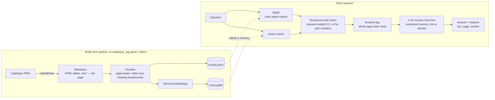

# Architecture and design decisions

## The problem with the first version

The April prototype stored each catalogue as **one** vector-database entry and sent the model
the **first 2,000 characters** of the top five catalogues. The right catalogue was usually found
(92% of questions) but the answer text was inside those 2,000 characters for only 30% of them;
a 400 KB catalogue is mostly invisible at that cut-off. Its prompt also told the model to
"reference specific NZ Building Code clauses" and "state vendor approval status explicitly",
which the catalogues never contain: an invitation to invent. It answered 20-25% of the evaluation
questions correctly (the figure moves a little between runs).

## Decisions

**Chunk by page, keep tables as rows.** Catalogues are specification tables. Each chunk stays on
one page (so every answer can cite a page), tables become `cell | cell` rows, and a table too big
for one chunk is split by rows with its header row repeated. Each chunk carries a breadcrumb
(`H200 Wireless access handle > Technical data`) so an orphaned row like `Battery | 1 x Lithium CR123A` still
says which product it describes. 54 catalogues become 3,062 chunks.

**Keyword search is not optional here.** Part numbers ("CH/10/900", "570MT5+M") are
meaningless to an embedding model. A real BM25 (proper IDF, length normalisation) with a
code-aware tokenizer keeps each code whole and also splits it at separators and at letter/digit
boundaries, because catalogues glue model and variant together: "C700HOSIL" is model C700,
hold-open, silver. That one tokenizer change took keyword recall from 92% to 100%.

**Fuse with reciprocal rank fusion, weighted towards keywords.** RRF combines rankings without
calibrating BM25 scores against cosine similarities. On this corpus keyword search alone beats
embeddings alone (100% vs 80% of answers reachable), so the fusion weights keywords 1.5x, and 2x
when the question contains a part number. The weight was chosen with `eval/sweep_weights.py`:
1.5 to 3.0 all reach 98%, so the smallest was kept. With 40 questions, finer tuning would be
fitting noise.

**Small-to-big retrieval.** Chunks are matched individually, but when a matched chunk's page is
short (under 3,500 characters) the model receives the whole page as one source. The first test
question showed why: an access handle's battery type and battery life sit in neighbouring chunks
of a one-page spec sheet, and the model saw only one of them.

**Cite or decline.** The model gets numbered sources and must cite `[n]` after each claim. When
nothing in the sources answers the question it must start with `NOT_FOUND`, which the API turns
into a clearly marked "not in the catalogues" answer. Citations are parsed back to document,
page and section, so the UI can show exactly what supports each sentence. On the six
deliberately unanswerable questions (vendor approvals, prices, building-code clauses, a
competitor comparison) it declines every time.

**Measure everything against the old version.** `eval/run_eval.py` runs the prototype, reproduced
with its original retrieval code and prompt but the same language model, beside each new
retriever, so improvements are attributable to the design and not to a better model.

## What the evaluation caught in the evaluation

Two expected answers in the first draft of the question set were wrong: one fact belonged to a
neighbouring product on the same page (a deadlock, not the deadlatch above it), another to a different
model in the same range. Both were found because the system disagreed with the
answer key and the source text sided with the system. The questions were corrected and the saved
answers re-scored without regenerating them (`--rescore`).

## Known limits

- **One remaining miss:** the weight of one safe model. The safe catalogue gives
  each model a tiny chunk with near-identical wording; retrieval surfaces the wrong safes and the
  model correctly says it cannot find the figure. A product-name boost against section headings
  would likely fix it.
- **The answer key is string matching.** "Correct" means every expected fact (with spelling
  variants) appears in the answer. It cannot judge an answer that is right but phrased very
  differently, and it does not penalise extra, unsupported detail; citations partly cover that.
- **40 + 6 questions is a small set.** It is enough to show the large effects here (30% to 98%);
  it is too small to separate configurations within a few points of each other.
- **No reranker.** A cross-encoder reranker over the fused list is the obvious next step and was
  left out to keep the system CPU-only and cheap.
