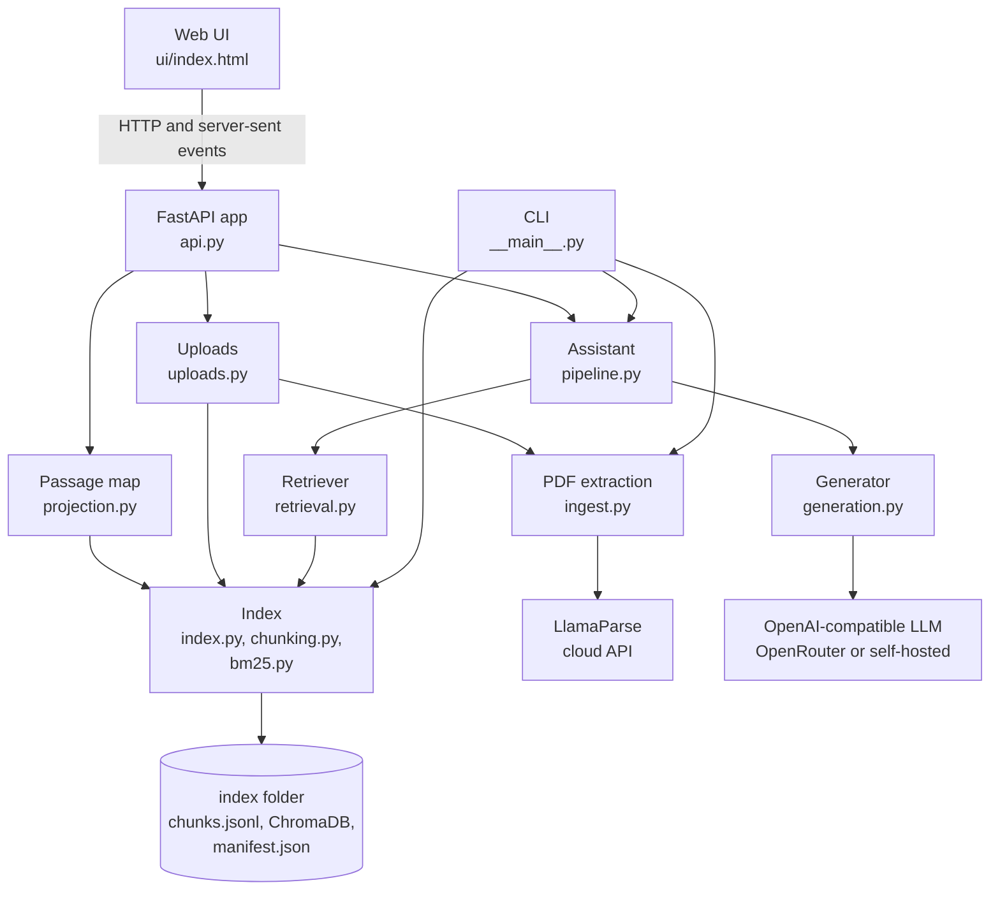

# Architecture and design decisions

How Catalogue RAG is put together and why each part works the way it does. Setup and usage are in the
[README](../README.md); the test levels are in [testing.md](testing.md).

## Components

| Module | Responsibility |
|---|---|
| `ingest.py` | Sends each new PDF to LlamaParse and saves the Markdown it returns (specification tables as HTML, a `---` line between pages) with a small metadata header. Markdown and text files are saved as they are. |
| `chunking.py` | Splits each page into chunks of at most 1,200 characters, keeps tables as rows and adds a heading breadcrumb to every chunk. |
| `bm25.py` | Okapi BM25 (k1 1.5, b 0.75, Robertson-Sparck Jones IDF) with a tokenizer built for part numbers. |
| `index.py` | Writes `chunks.jsonl`, embeds the chunks into ChromaDB, records `manifest.json`, and replaces single documents without a rebuild. Loading the index rebuilds BM25 in memory from `chunks.jsonl`. |
| `retrieval.py` | Runs BM25 and vector search, fuses the rankings and expands short pages. |
| `generation.py` | Builds the prompt, streams the reply, parses citations and detects declines. |
| `pipeline.py` | Question in, cited answer out; also the event stream for the web UI and the question log. |
| `api.py` | The FastAPI endpoints and the route that serves the web UI. |
| `uploads.py` | Token-gated upload queue: one worker thread, one job at a time. |
| `projection.py` | 2-D PCA of the passage embeddings for the passage map, cached in `index/map.json`. |

## Decisions

**Chunk by page, keep tables as rows.** Catalogues are mostly specification tables. Each chunk stays on one page,
so every answer can cite a page. Tables become `cell | cell` rows, and a table too big for one chunk is split by
rows with its header row repeated in every piece. Each chunk carries a breadcrumb such as
`Acme Electronic Access Control > Acme H200 Wireless access handle > Technical data`, so an isolated row like
`Battery | 3 x LR03 AAA 1.5V` still says which product it describes. The breadcrumb is part of what gets
embedded and keyword-indexed.

**Keyword search for part numbers.** Codes such as `CH/10/1200` or `C700HOSIL` mean little to an embedding
model. BM25 with proper IDF and length normalisation matches them exactly. Its tokenizer keeps each code whole
and also splits it at separators and at letter/digit boundaries, because catalogues glue model and variant
together: `C700HOSIL` is model C700, hold-open, silver, so a question about "the C700 closer" still matches.
Query terms that look like codes count double inside BM25.

**Fuse with weighted reciprocal rank fusion.** RRF combines the two rankings without calibrating BM25 scores
against cosine similarities: each chunk scores the sum of `weight / (60 + rank)` over the retrievers, from 40
candidates per retriever. In the evaluation on 54 public catalogues, keyword search alone puts the answer text in
front of the model for 100% of the answerable questions and embeddings alone for 82%, so keywords get weight 1.5,
doubled when the question contains a part number. The weight comes from `eval/sweep_weights.py`
([results](../eval/results/weight_sweep.md)): with 8 sources every weight from 1.5 to 3.0 reaches 98%, so the
smallest of them is used. With 40 answerable questions, finer tuning would fit noise.

**Small-to-big retrieval.** Chunks are matched individually, but when a matched chunk's page has several chunks
totalling at most 3,500 characters, the model receives the whole page as one source, and each page appears only
once. A one-page specification sheet then arrives complete: the battery type in one chunk and the battery life in
the next both reach the model, and a dense page cannot crowd out the others.

**Cite or decline.** The model gets numbered sources and must put `[n]` after each claim and copy part numbers,
dimensions and units exactly. When nothing in the sources answers the question it must start its reply with
`NOT_FOUND`; the pipeline turns that into a clearly marked "not in the catalogues" answer. A reply that cites
nothing but says the extracts don't mention something is also treated as a decline, while a cited answer that
notes a gap stays an answer. While streaming, the first characters are held back until it is clear whether the
reply starts with the marker, so the marker itself is never shown.

**Deterministic where it matters.** Exact code matching, mapping citations back to document, page and section,
and deciding whether a reply is a decline are plain code with unit tests, not model behaviour.

**Add catalogues without a rebuild.** `index.add_documents` chunks and embeds only the new document and removes
any earlier version with the same name from both `chunks.jsonl` and ChromaDB. The chunk file is written last and
replaced atomically, so a failure part-way leaves the previous chunk list in place. Uploads are off unless
`CATALOGUE_ADMIN_TOKEN` is set, run one at a time on a single worker, and accept only PDF (checked by signature),
Markdown and text files up to `CATALOGUE_MAX_UPLOAD_MB`.

**Passage map.** `GET /api/map` projects the 384-dimension embeddings of every passage onto their two main
directions (PCA), so passages with similar meaning sit close together, coloured by catalogue. The projection is
cached next to the index and rebuilt when the index changes. The streaming answer sends the ids of every passage
shown to the model, and the UI lights those up.

## Evaluation method

`eval/run_eval.py` runs every question through several configurations with the same language model, so the
differences come from retrieval and prompting, not from the model.

| Configuration | What the model is given |
|---|---|
| Whole-document baseline (`eval/baseline/`) | Each catalogue stored as one vector entry; the first 2,000 characters of each of the top 5 catalogues, with a generic catalogue-assistant prompt |
| Keyword only (BM25) | The top 8 sources from BM25 (retrieval metrics only) |
| Embeddings only | The top 8 sources from vector search (retrieval metrics only) |
| Hybrid, full pipeline | The top 8 fused, page-expanded sources and the cite-or-decline prompt |

| Metric | Meaning |
|---|---|
| Expected document retrieved | An expected document is among the sources given to the model |
| Answer text reaches the model | The expected fact text is inside what the model is shown |
| Fact MRR | 1 / rank of the first source that contains the fact |
| Correct | Every expected fact (with spelling variants) appears in the answer |
| Cites the right document | At least one citation points at an expected document |
| Declines unanswerable | On the deliberately unanswerable questions, the answer says the catalogues don't cover it |
| Wrongly declines | On answerable questions, the answer declined |
| p50 / p95 | Seconds per answer |

Results on 54 public catalogues and 46 questions: [`eval/results/REPORT.md`](../eval/results/REPORT.md), summarised
in the [README](../README.md#evaluation). The same harness runs on the bundled fictional sample:
[`eval/results/sample/REPORT.md`](../eval/results/sample/REPORT.md).

## Scope

How a company would extend each of these (GPU models, a reranker, access control, connectors) is in
[`enterprise.md`](enterprise.md).

- **Answers what the catalogues state.** It does not certify compliance; prices, approvals and standards are
  declined unless a catalogue states them.
- **No cross-encoder reranker.** This keeps the system CPU-only. Near-identical neighbouring products in one
  catalogue (for example several safe models described with the same wording) can compete for the top places.
- **Small English embedding model.** all-MiniLM-L6-v2, 384 dimensions, run locally.
- **One question at a time.** No conversation memory; one admin token and no user accounts.
- **String-matched scoring.** "Correct" means every expected fact appears in the answer. It cannot judge an answer
  that is right but phrased very differently, and it does not penalise extra detail; citations cover part of
  that. 40 answerable plus 6 unanswerable questions show large differences between configurations, not
  differences of a few points.
