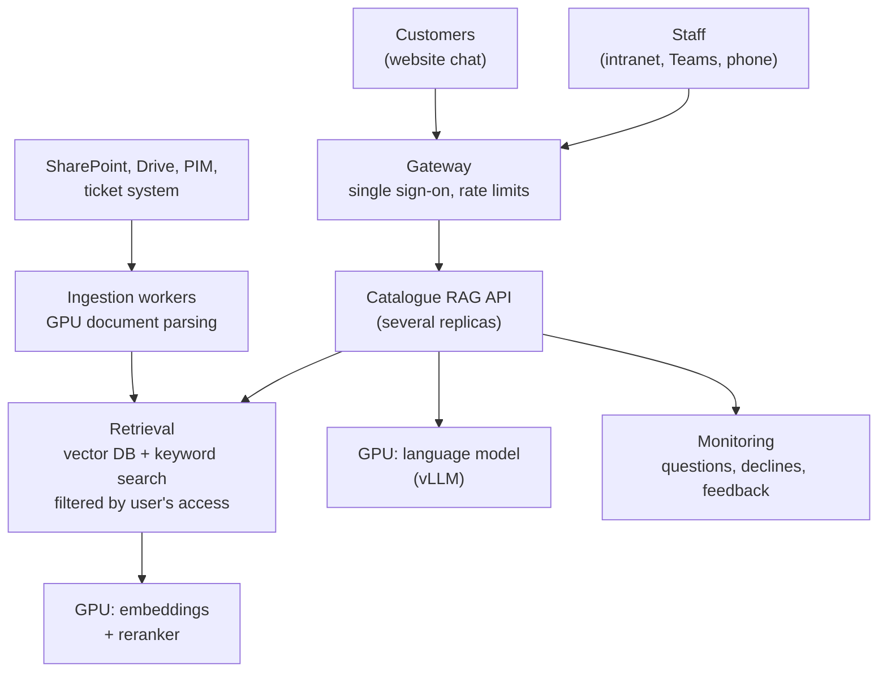

# Adopting Catalogue RAG in a company

This page is for a company that wants its own AI knowledge base: what the system does today, what limits it
has, how to remove those limits (most of them with your own GPU hardware), and a phased plan to get there.
Figures for hardware are starting points, not quotes; the evaluation harness in this repository is how you
confirm a choice on your own documents before buying anything.

## What it gives a company

**Instant, cited answers from the company's own documents.** Product catalogues, installation guides,
service bulletins, technical data sheets, compliance documents, resolved support tickets. Every claim links
to the page it came from, so staff can check it in seconds, and the system says "not in the documents"
rather than guess.

**One knowledge base, two audiences.**

| | External (customers, partners) | Internal (staff, installers, service) |
|---|---|---|
| Where | Website chat, partner portal | Intranet, Teams/Slack, the counter PC, a phone on site |
| Documents | Public catalogues, brochures, public data sheets | Everything external, plus price lists, installation notes, service bulletins, ticket history |
| Typical questions | "Which closer for a 1100mm, 80kg door?" | "What fixed this fault code last time?", "Trade price for the H200 in black?" |

The safe way to serve both is to label every document with who may read it and filter **before** retrieval,
so the language model never sees a passage the user is not allowed to read. Filtering after the answer is
written is not safe: the text has already been used.

**Does it replace experts?** No, it scales them. In most companies a few experienced people answer the same
documented questions all day, and their knowledge leaves with them.

- Questions whose answer is written down (specs, part numbers, compatibility, documented fixes) get an
  instant, cited answer, at any hour, for anyone.
- Questions that are not documented, safety-critical or a judgement call are declined and routed to an
  expert. The expert's answer is saved as a document, so the next person gets it from the system.
- The list of declined questions is a ranked to-do list for the documentation team.

The experts' time moves from repeating answers to the genuinely hard problems, and the company's knowledge
stops depending on who happens to be in the office.

## What it does well today

- On 54 public catalogues and 46 questions: 98% of answerable questions correct, 100% of unanswerable questions
  declined, a median of 2.3 s per answer.
- Exact part-number handling (keyword search with a code-aware tokenizer) together with meaning-based search.
- Citations to document, page and section; streaming answers; a passage map that shows what was read.
- New documents added from the browser in about a minute, without a rebuild, behind an admin token.
- Model-agnostic: any OpenAI-compatible endpoint, cloud or self-hosted (`LLM_BASE_URL`).
- An evaluation harness, so every change of model, prompt or settings is measured before it ships.

## Current limits, and how to overcome them

| Limit today | What it means | How to overcome it |
|---|---|---|
| **Answers come from a cloud model API** (OpenRouter by default) | Questions and the retrieved passages leave the company | Self-host an open-weight model on your own GPUs with vLLM, TGI or Ollama; set `LLM_BASE_URL`. Supported now |
| **PDF extraction uses a cloud service** (LlamaParse) | Documents leave the company when they are added | Run an open-source parser such as Docling or Marker on your own GPU; vision-language models for scanned pages |
| **Small CPU embedding model** (MiniLM, English, 384 dimensions) | Weaker on paraphrases and non-English text | GPU embedding models such as BGE-M3 (multilingual) or Qwen3-Embedding; make the model configurable (roadmap) |
| **No reranker** | A near-identical neighbouring product can outrank the right one | A cross-encoder reranker (for example bge-reranker-v2-m3) on GPU over the fused results |
| **One admin token, no user accounts** | Cannot yet mix internal and public documents safely | Single sign-on (Microsoft Entra ID, Okta, Google) and per-document access labels enforced at retrieval |
| **Single server** (embedded ChromaDB, in-memory BM25, one upload worker) | Comfortable to roughly 100,000 passages and a handful of simultaneous users | A server vector database (Qdrant, pgvector) and search engine (OpenSearch), several API replicas, a job queue |
| **Text only** | Technical drawings, wiring diagrams and photos are not understood | Vision-language models (for example Qwen2.5-VL) to describe figures at indexing time |
| **One question at a time** | No follow-ups like "and in black?" | Conversation memory with query rewriting |
| **Small evaluation set, string matching** | 46 questions show large effects but not small ones | Hundreds of real staff questions, model-graded scoring with human spot checks, run as a release gate in CI |
| **Manual document upload** | Knowledge goes stale if nobody uploads the new catalogue | Connectors to SharePoint, Google Drive or a PIM system, with scheduled re-indexing |
| **Logs only** | No view of what people ask or where answers fail | A dashboard of top questions, declines (documentation gaps), feedback buttons and latency |

## Running on your own GPU servers

**Why self-host.** Data never leaves the company (often required for internal documents, customer data and
compliance); predictable cost at high volume instead of per-token billing; a fixed model version that does not
change underneath you; and room for larger models, rerankers and vision models that would be slow or costly
through an API.

**Target architecture.**



**Connecting the current code to a self-hosted model** needs no code change:

```bash
# on the GPU server (example: an open-weight Qwen3 model served by vLLM)
vllm serve Qwen/Qwen3-30B-A3B-Instruct-2507 --port 8000

# in Catalogue RAG's .env
LLM_BASE_URL=http://gpu-server:8000/v1
LLM_MODEL=Qwen/Qwen3-30B-A3B-Instruct-2507
```

Then run `python eval/run_eval.py` on your own question set and compare with the cloud model's score. If the
smaller model scores as well on your documents, you need less hardware.

**Rough sizing** (one company, tens of thousands of pages; verify with the evaluation harness):

| Workload | Example models | GPU memory, roughly | Example hardware |
|---|---|---|---|
| Embeddings + reranker | BGE-M3, bge-reranker-v2-m3 | under 8 GB | Shares a GPU with the model below, or one small GPU |
| Small language model | 7-14B models (Qwen3-8B/14B, Llama 3.1 8B) | 16-32 GB | 1 x 24 GB card (NVIDIA L4, RTX 4090) with 8-bit or 4-bit weights |
| Mid-size language model | Qwen3-30B-A3B (mixture of experts), 30B-class dense models | about 17 GB (4-bit) to 61 GB (16-bit) | 1 x 48 GB (L40S) quantised, or 1 x 80 GB (A100, H100) |
| Large language model | 70B-class dense models | 40-80 GB quantised, 140 GB at 16-bit | 1 x 80 GB quantised, or 2 x 80 GB |
| Frontier-size open model (used in this project's evaluation) | Qwen3-235B-A22B | about 120 GB (4-bit), 235 GB (8-bit), 470 GB (16-bit) | A node of 4-8 x 80 GB GPUs |
| Document parsing and vision | Docling, Marker, Qwen2.5-VL | 8-24 GB | Batch jobs at night on the same GPUs |

Retrieval does most of the heavy lifting for catalogue questions, so a mid-size model is often enough. Measure
it: the evaluation harness runs the same questions against each candidate model.

## Security and governance checklist

- Access labels on every document; filter at retrieval, never after generation.
- Single sign-on; separate public and internal deployments if in doubt.
- Uploads only for named administrators (today: `CATALOGUE_ADMIN_TOKEN`; later: roles).
- Keep the cite-or-decline rule: answers without a source are not shown.
- Log questions and cited pages for audit (already written to `logs/questions.jsonl`); define retention.
- Run the evaluation as a release gate whenever the model, prompt, settings or document set changes.
- Treat price and safety answers as "check the cited page" by default.

## Adoption plan

| Phase | Weeks | Scope | Done when |
|---|---|---|---|
| **1. Pilot** | 2-4 | One product family's public catalogues; 100 real questions collected from the counter or sales team; cloud or a single GPU | The evaluation score on those questions is agreed acceptable by the experts |
| **2. Internal knowledge base** | 4-8 | Add internal documents with access labels, single sign-on, Teams or intranet access, feedback buttons | Staff use it daily; declined questions feed the documentation backlog |
| **3. Self-hosted and connected** | 4-8 | Own GPU server (vLLM, embeddings, reranker), self-hosted PDF parsing, SharePoint/PIM connectors, dashboard | No document or question leaves the company; new catalogues appear automatically |
| **4. External assistant** | 4 | Public-documents-only deployment on the website or partner portal, rate limits, monitoring | Customers get cited answers; hand-off to a person when it declines |

## Roadmap for this repository

- Configurable embedding model and a cross-encoder reranker (GPU optional).
- Self-hosted document parsing (Docling) as an alternative to LlamaParse.
- Users, roles and per-document access labels filtered at retrieval.
- Conversation memory for follow-up questions.
- Answer feedback (thumbs up/down with a reason) feeding the evaluation set.
- Connectors for SharePoint and Google Drive with scheduled re-indexing.
- Docker Compose deployment with a vLLM service.
